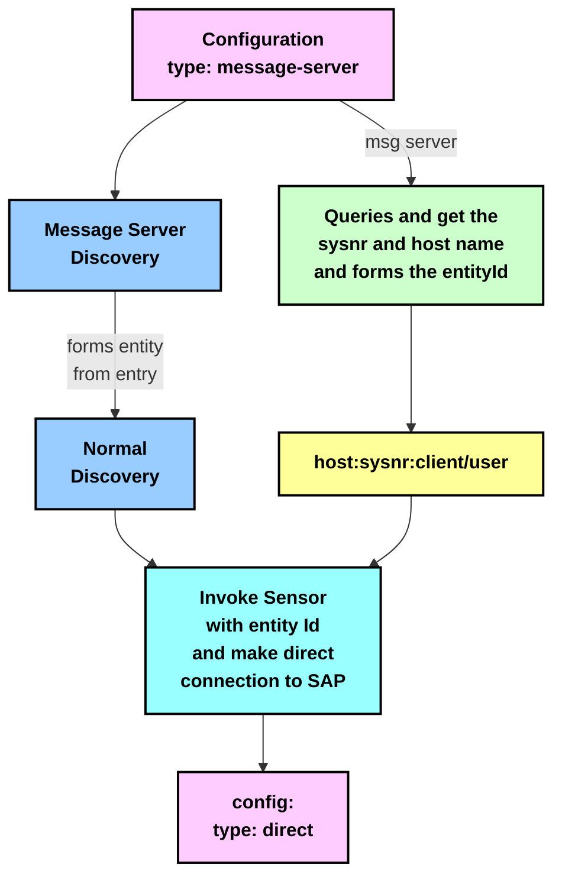

# SAP Message Server Connection Flow Diagram (Mermaid)

## Diagram Explanation

This diagram illustrates the SAP Message Server connection flow:

1. **Configuration** (type: message-server) - The initial configuration specifies a message server connection type.

2. **Message Server Discovery** - The process begins with discovering the message server.

3. **Normal Discovery** - An alternative discovery path that forms an entity from the configuration entry.

4. **Message Server Queries** - The message server queries and retrieves the system number (sysnr) and host name to form the entity ID.

5. **Entity ID Formation** - The entity ID is formed using the format: `host:sysnr:client/user`.

6. **Sensor Invocation** - The system invokes a sensor with the entity ID and establishes a direct connection to SAP.

7. **Final Configuration** - The connection is established with a direct connection type.

// Made with Bob
